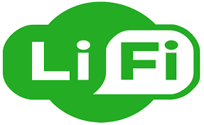

## LIFI
## 1.Pengertian LIFI

  Light Fidelity (disingkat Li-Fi) merupakan teknologi komunikasi nirkabel dua arah yang berkecepatan tinggi dan mirip dengan teknologi Wi-Fi. Istilah ini dicetuskan oleh Harald Haas dan merupakan sebuah bentuk dari komunikasi yang memanfaatkan cahaya tampak. Teknologi ini dapat menjadi pelengkap komunikasi RF (Wi-Fi atau jaringan seluler).Sejauh ini, kecepatan yang telah tercatat adalah 100 kali lebih cepat dari penerapan Wi-Fi,atau hampir setara 224 gigabit per detik.
  Definisi LiFi (Light Fidelity) merupakan sistem pada teknologi komunikasi nirkabel dua arah yang memiliki kecepatan 100 kali lebih cepat dibandingkan dengan WiFi.Teknologi komunikasi nirkabel ini ditemukan pertama kali dari hasil percobaan yang dilakukan oleh University College dan University Oxford dengan menggunakan media cahaya untuk mentransfer data dengan kecepatan yang tinggi (kurang lebih 100 Gbps per detik).Perbedaannya dengan Wifi adalah teknologi ini tidak menggunakan frekuensi radio konvensional, tetapi menggunakan gelombang cahaya.
  Li-Fi yang memiliki kecepatan data berkali-kali lipat dibandingkan dengan Wi-Fi ini disebabkan karena jenis LED yang merupakan semikonduktor punya sifat berbeda dari jenis lampu lain. Dengan sifat dan ciri-ciri seperti ini membuat LED mampu untuk beralih on dan off dalam beberapa nanodetik atau miliar detik.Nanodetik ini jika dikonversikan dalam kecepatan data setara dengan 1 Gbits/s. Maka dari itu saat Wi-Fi hanya bisa mencapai 100 Mbits/s kecepatan data, maka ini artinya Li-Fi memiliki kecepatan 10 kali lebih cepat dari Wi-Fi.
  
 ## 2.Perkembangan LIFI
 
  Perkembangan teknologi komunikasi beberapa tahun ini telah mengalami peningkatan, salah satunya teknologi LiFi.LiFi (Light Fidelity) adalah media transmisi data dengan koneksi berbasis cahaya dengan hasil uji lab dapat mengantarkan informasi sebanyak 224 GB/detik atau sebanding dengan mengirimkan 18 film yang memiliki masing-masing ukuran 1.5 GB dalam kurun waktu satu detik saja.Perkembangan LiFi hingga saat ini masih terdapat beberapa hambatan, salah satunya sinyal yang dimiliki teknologi ini tidak dapat menembus tembok ataupun area yang memiliki sekat.Seiring dengan tingginya pertumbuhan pasar pada perangkat sensor dan loT, maka semakin tinggin pula data transmisi yang diperlukan.Namun, hingga saat ini infrastruktur yang dimiliki belum dapat handling kuantitas data yang diperlukan untuk transmisi di perangkat loT.Light Fidelity mungkin dapat menjadi solusi apabila pengguna dan perancang telah menginginkan pertumbuhan kontinyu pada loT dan Big Data.Perusahaan pencetus Light Fidelity yang bernama pureLiFi telah memunculkan sistem plug-and-play pada sistem teknologi ini dengan kapasistas 115 MB/detik.Proyek lain yang dimilikinya masih dalam tahap pengembangan dan uji coba pada rumah sakit dan perkantoran di beberapa daerah di dunia.
  
  ## 3.Cara Kerja LIFI
  
   Cara kerja teknologi ini adalah menggunakan sumber cahaya yang cukup seperti LED (Light Emitting Diodes) ataupun Light Sensor, kemudian ujung perangkat lain akan melakukan deteksi serta mengartikannya sebagai biner yang sama kemudian akan dapat dibaca oleh komputer.Artinya, teknologi ini dapat bekerja apabila masing-masing perangkat yang dimiliki dapat terhubung dan saling berpasangan untuk melakukan kegiatan seperti menstransmisikan data.Contoh sederhana kerja Light Fidelity yang dapat kita rasakan saat ini adalah cahaya yang terdapat pada remote TV (cahaya infra-merah) yang mampu melakukan transmisi data lebih dari 1000 bps.Sedangkan lampu LED (Light Emitting Diodes) yang digunakan saat ini telah mengalami perkembangan dengan kemampuan transmisi data yang stabil dan terlihat seperti cahaya lampu pada umumnya.
   
   ## 4.Perbedaan WIFI Dan LIFI
   
   LiFi dan WiFi merupakan dua teknologi nirkabel (tanpa kabel) dua arah yang memiliki kecepatan tinggi.Namun keduanya memiliki perbedaan pada media penghantarnya yaitu berupa gelombang cahaya dan gelombang radio.WiFi merupakan pemancar jaringan internet melalui gelombang radio, namun LiFi menggunakan gelombang cahaya untuk media transmisinya.Teknologi yang dimiliki oleh WiFi memiliki kecepatan yang lebih rendah dibandingkan dengan Light Fidelity karena kecepatan gelombang cahaya lebih cepat 10.000 kali dibandingkan dengan gelombang radio.Namun dibalik itu, apabila ia tidak terdapat cahaya yang optimal maka tidak dapat digunakan dan lebih baik menggunakan WFi dengan gelombang radionya.Selain itu, perbedaan dari keduanya adalah mengenai biaya yang diperlukan untuk menggunakan teknologi tersebut.Instalasi WiFi memerlukan biaya yang lebih rendah dibandingkan dengan Light Fidelity.
   
   ## 5.Keuntungan Dan Keunggulan LIFI
   
   Keuntungan menggunakan Li-Fi ini adalah memudahkan siapa saja untuk mengakses internet dimana pun bahkan di wilayah terpencil sekalipun yang tidak bisa dijangkau oleh kabel optik. Selain itu Li-Fi juga dapat digunakan mengontrol kondisi lalu lintas dengan cara menempatkan teknologi baru ini ke LED mobil.Fungsi yang sama ternyata juga dapat diterapkan dengan lampu overhead pesawat. Keunggulan lain dari teknologi Li-Fi adalah mampu mengurangi polusi elektromagnetik yang dihasilkan oleh gelombang radio.
   
   ## 6.Kelemahan Dan Tantangan LIFI
   
   Meski memiliki banyak keunggulan teknologi Li-Fi juga masih memiliki beberapa kelemahan dibanding sistem Wi-Fi konvensional. Li-Fi yang diterapkan secara base station pada langit-langit ruangan ini membutuhkan direct line of sight atau “pandangan” langsung ke perangkat tujuan. Direct line ini ternyata juga harus dilengkapi receiver khusus, seperti koneksi infra red pada gadget jadul.Selain itu, perangkat tujuan ini harus tidak boleh dipindah-pindahkan. Dari perkembangan yang ada, teknologi Li-Fi juga menyimpan banyak tantangan antara lain membutuhkan line-of-sight yang sempurna untuk mengirimkan data. Tantangan berat lainnya yaitu cara mengirimkan kembali data ke pemancar secara optimal.
